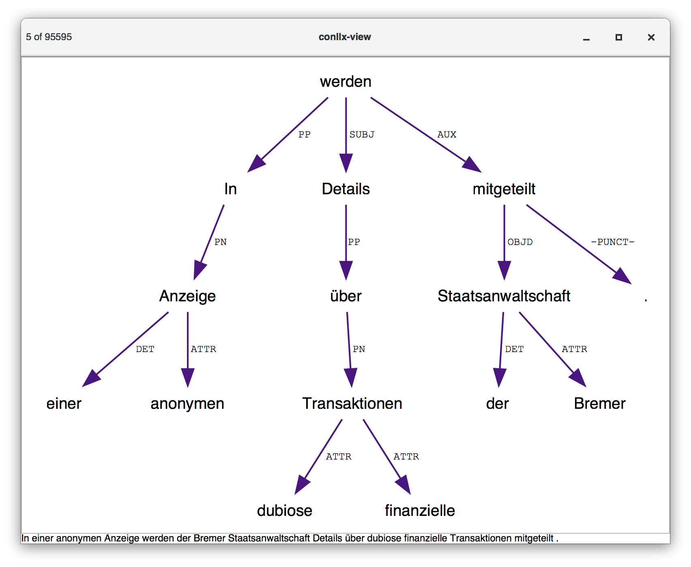

# conllx-view

## Introduction

`conllx-view` is a small viewer for CoNLL-X files. It does not aim to be a
general treebank viewer search tool, such as [Dact](https://rug-compling.github.io/dact/)
or [TüNDRA](https://weblicht.sfs.uni-tuebingen.de/weblichtwiki/index.php/Tundra).
`conllx-view` allows you to quickly browse through dependency structures from a
file or pipeline and save trees in Graphviz Dot or TikZ dependency format.

The minimalistic interface was inspired by MuPDF and MPV.

## Keyboard shortcuts

| Key | Description   |
| --- | ------------- |
| n   | Next tree     |
| p   | Previous tree |
| =   | Zoom in       |
| -   | Zoom out      |
| d   | Save as dot   |
| t   | Save as TikZ  |
